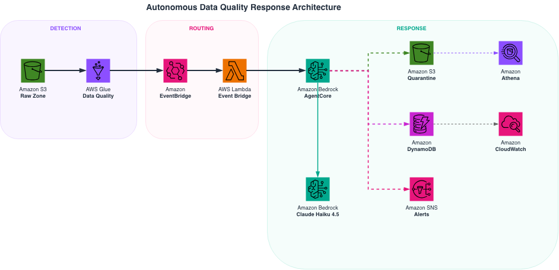

# Agentic Data Quality Pipeline

An autonomous agent that responds to data quality violations in your S3 data lake. AWS Glue Data Quality detects issues (null spikes, stale data, distribution outliers, schema drift). A Strands Agent on Amazon Bedrock AgentCore diagnoses root causes via LLM reasoning, quarantines bad records, and alerts pipeline owners — with every decision traced and auditable.

**The key idea:** Glue DQ tells you *something is wrong*. The agent tells you *why* and *takes action*.



## How It Works

```
Bad data lands in S3
  → Glue DQ evaluates DQDL ruleset → detects violations
    → EventBridge routes failure event → Lambda bridge
      → AgentCore invokes the agent
        → Agent diagnoses root cause (LLM reasoning)
          → Quarantines bad records to isolation zone
            → Sends SNS alert with diagnosis
              → Logs every decision to DynamoDB
```

## Prerequisites

| Requirement | Why |
|---|---|
| AWS account | All infrastructure runs here |
| [Python 3.11+](https://www.python.org/downloads/) | Agent and CDK code |
| [uv](https://docs.astral.sh/uv/getting-started/installation/) | Python package manager |
| [Node.js 18+](https://nodejs.org/) | CDK CLI and dashboard frontend |
| [AWS CLI v2](https://docs.aws.amazon.com/cli/latest/userguide/getting-started-install.html) | Configured with credentials (`aws configure`) |
| [AWS CDK v2](https://docs.aws.amazon.com/cdk/v2/guide/getting_started.html) | `npm install -g aws-cdk` |
| Bedrock model access | Enable **Claude Haiku 4.5** in us-east-1 via the [Bedrock console](https://console.aws.amazon.com/bedrock/home#/modelaccess) |
| [agentcore CLI](https://docs.aws.amazon.com/bedrock/latest/userguide/agentcore-get-started.html) | For deploying the agent runtime |

## Setup (One-Time)

### 1. Clone and install dependencies

```bash
git clone https://github.com/aws-samples/sample-agentic-data-quality-pipeline.git
cd sample-agentic-data-quality-pipeline
uv sync --all-extras
cd dashboard/ui && npm install && cd ../..
```

### 2. Bootstrap CDK (if you haven't already in this account/region)

```bash
npx cdk bootstrap aws://$(aws sts get-caller-identity --query Account --output text)/us-east-1
```

### 3. Deploy all infrastructure

```bash
cd cdk
uv run --extra cdk -- npx cdk deploy --app "python3 app.py" --all --require-approval never
cd ..
```

This creates: S3 bucket, Glue database + tables, Glue DQ ruleset, EventBridge rule, Lambda bridge, Athena workgroup, DynamoDB tables, SNS topic, CloudWatch alarms + dashboard.

### 4. Download sample data and upload to S3

```bash
# Download 3 months of NYC TLC yellow taxi data (~150MB)
uv run python data/download_data.py --start-year 2025 --start-month 7 --num-months 3

# Get your bucket name (auto-created as dq-agent-demo-<ACCOUNT_ID>)
BUCKET="dq-agent-demo-$(aws sts get-caller-identity --query Account --output text)"

# Upload to S3 with Hive-style partitioning
uv run python data/upload_to_s3.py --source data/raw --bucket $BUCKET --prefix raw/yellow_taxi
```

### 5. Add Glue partitions

```bash
BUCKET="dq-agent-demo-$(aws sts get-caller-identity --query Account --output text)"
for MONTH in 07 08 09; do
  aws glue create-partition \
    --database-name dq_agent_demo \
    --table-name raw_yellow_taxi \
    --partition-input "{
      \"Values\": [\"2025\", \"$MONTH\"],
      \"StorageDescriptor\": {
        \"Location\": \"s3://$BUCKET/raw/yellow_taxi/year=2025/month=$MONTH/\",
        \"InputFormat\": \"org.apache.hadoop.hive.ql.io.parquet.MapredParquetInputFormat\",
        \"OutputFormat\": \"org.apache.hadoop.hive.ql.io.parquet.MapredParquetOutputFormat\",
        \"SerdeInfo\": {\"SerializationLibrary\": \"org.apache.hadoop.hive.ql.io.parquet.serde.ParquetHiveSerDe\"},
        \"Columns\": $(aws glue get-table --database-name dq_agent_demo --name raw_yellow_taxi --query 'Table.StorageDescriptor.Columns' --output json)
      }
    }" 2>/dev/null || true
done
```

### 6. Deploy the agent to AgentCore

```bash
cd agent
agentcore configure --entrypoint agent.py --name dq_agent --requirements-file requirements.txt --region us-east-1 --protocol HTTP --non-interactive
bash ac_deploy.sh
cd ..
```

### 7. Grant the agent runtime permissions

The AgentCore runtime role needs access to DynamoDB, Athena, S3, Bedrock, SNS, and CloudWatch. Replace the role name with the one output by `agentcore configure` (typically `AmazonBedrockAgentCoreSDKRuntime-us-east-1-<suffix>`):

```bash
ROLE_NAME=$(aws iam list-roles --query "Roles[?contains(RoleName,'AgentCoreSDKRuntime')].RoleName" --output text)
ACCOUNT_ID=$(aws sts get-caller-identity --query Account --output text)

aws iam put-role-policy --role-name "$ROLE_NAME" --policy-name DqAgentDataAccess --policy-document "{
  \"Version\": \"2012-10-17\",
  \"Statement\": [
    {\"Effect\":\"Allow\",\"Action\":[\"dynamodb:PutItem\",\"dynamodb:GetItem\",\"dynamodb:Query\",\"dynamodb:Scan\",\"dynamodb:BatchWriteItem\"],\"Resource\":\"arn:aws:dynamodb:us-east-1:${ACCOUNT_ID}:table/*\"},
    {\"Effect\":\"Allow\",\"Action\":[\"athena:StartQueryExecution\",\"athena:GetQueryExecution\",\"athena:GetQueryResults\"],\"Resource\":\"*\"},
    {\"Effect\":\"Allow\",\"Action\":[\"s3:GetObject\",\"s3:PutObject\",\"s3:ListBucket\",\"s3:GetBucketLocation\"],\"Resource\":[\"arn:aws:s3:::dq-agent-demo-${ACCOUNT_ID}\",\"arn:aws:s3:::dq-agent-demo-${ACCOUNT_ID}/*\"]},
    {\"Effect\":\"Allow\",\"Action\":[\"glue:GetTable\",\"glue:GetPartitions\",\"glue:GetDatabase\"],\"Resource\":\"*\"},
    {\"Effect\":\"Allow\",\"Action\":[\"bedrock:InvokeModel\"],\"Resource\":\"*\"},
    {\"Effect\":\"Allow\",\"Action\":[\"sns:Publish\",\"sns:ListTopics\"],\"Resource\":\"*\"},
    {\"Effect\":\"Allow\",\"Action\":[\"cloudwatch:PutMetricData\"],\"Resource\":\"*\"}
  ]
}"
```

### 8. Subscribe to alerts (optional)

```bash
aws sns subscribe \
  --topic-arn "arn:aws:sns:us-east-1:$(aws sts get-caller-identity --query Account --output text):dq-agent-alerts" \
  --protocol email \
  --notification-endpoint your-email@example.com
```

Check your email and confirm the subscription.

## Running the Demo

### Start the dashboard

```bash
# Terminal 1: Backend API
PYTHONPATH=. uv run uvicorn dashboard.api:app --reload --port 8000

# Terminal 2: Frontend
cd dashboard/ui && npm run dev
```

Open http://localhost:3000

### Quick demo flow

1. **Simulate Event** — Click "Simulate Event" to send a pre-built Glue DQ failure directly to the agent. This shows the agent's response in ~30 seconds without waiting for a real Glue DQ evaluation.

2. **Full production flow** — Click "Inject Chaos and Upload" to corrupt the data, then "Run Evaluation" to trigger a real Glue DQ evaluation. When Glue DQ detects the issues, EventBridge fires the event, Lambda invokes the agent, and the agent responds. Takes 2-3 minutes.

3. **Review results** — Check the Dashboard tab for quality scores and the Agent Activity tab for the full reasoning chain.

4. **Restore** — Click "Restore Everything" to reset.

### CLI test (no dashboard needed)

```bash
cd agent
agentcore invoke '{"prompt": "Glue DQ evaluation dq-test-001 on raw_yellow_taxi partition year=2025/month=09 has FAILED. Process the following evaluation results:\n\n{\"evaluation_id\":\"dq-test-001\",\"database\":\"dq_agent_demo\",\"table\":\"raw_yellow_taxi\",\"partition\":\"year=2025/month=09\",\"overall_state\":\"FAILED\",\"rule_results\":[{\"rule\":\"Completeness \\\"tpep_pickup_datetime\\\" > 0.98\",\"state\":\"FAILED\",\"evaluated_metrics\":{\"Column.tpep_pickup_datetime.Completeness\":0.93}}]}"}'
```

## How the Agent Responds

When the agent receives a Glue DQ failure event, it:

1. **Parses** the violations (which rules failed, what was observed, severity)
2. **Diagnoses** each violation using a focused LLM call (root cause analysis with historical context)
3. **Quarantines** bad records by running Athena UNLOAD to an isolated S3 zone
4. **Notifies** pipeline owners via SNS with severity, diagnosis, and recommended next steps
5. **Logs** every decision to DynamoDB with full reasoning for audit

## Cleanup

```bash
# Destroy all CDK infrastructure
cd cdk
uv run --extra cdk -- npx cdk destroy --app "python3 app.py" --all --force

# Remove the AgentCore agent
cd ../agent
agentcore destroy --agent dq_agent
```

## Cost

~$2.50–$3.00 per demo run. Breakdown: Glue DQ evaluation (~$1), Athena queries (~$0.50), Bedrock LLM calls (~$0.50), other services negligible at demo scale.

## License

MIT-0 — See [LICENSE](LICENSE).
